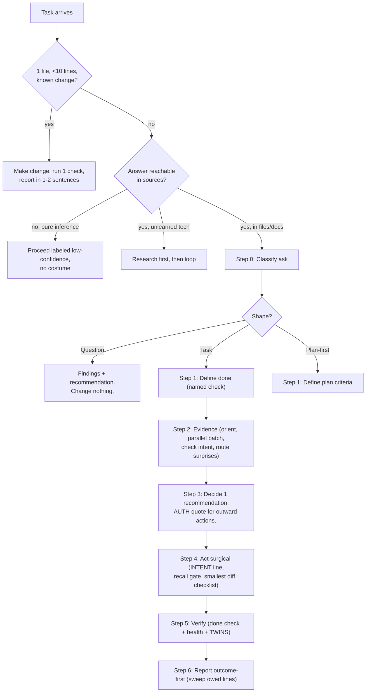

# Decision Flowcharts

```mermaid
flowchart TD
    START["Task arrives"] --> TRIV{"1 file, <10 lines,<br/>known change?"}
    TRIV -->|yes| TRIV_ACT["Make change, run 1 check,<br/>report in 1-2 sentences"]
    TRIV -->|no| FIT{"Answer reachable<br/>in sources?"}
    FIT -->|"no, pure inference"| CONF["Proceed labeled low-confidence,<br/>no costume"]
    FIT -->|"yes, unlearned tech"| RES["Research first, then loop"]
    FIT -->|"yes, in files/docs"| S0["Step 0: Classify ask"]
    S0 --> S0_DEC{"Shape?"}
    S0_DEC -->|Question| S0_Q["Findings + recommendation.<br/>Change nothing."]
    S0_DEC -->|Task| S1["Step 1: Define done (named check)"]
    S0_DEC -->|Plan-first| S1_P["Step 1: Define plan criteria"]
    S1 --> S2["Step 2: Evidence (orient, parallel batch,<br/>check intent, route surprises)"]
    S2 --> S3["Step 3: Decide 1 recommendation.<br/>AUTH quote for outward actions."]
    S3 --> S4["Step 4: Act surgical (INTENT line,<br/>recall gate, smallest diff, checklist)"]
    S4 --> S5["Step 5: Verify (done check + health + TWINS)"]
    S5 --> S6["Step 6: Report outcome-first (sweep owed lines)"]
```
