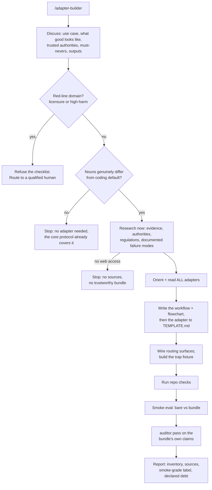

# adapter-builder

The Execution Protocol ships domain adapters translating core protocol into sector nouns. This skill makes new one and hands user usable step-by-step **workflow with flowchart** for domain, so lesser model can approach domain way Fable would.

Generation core is recording, not guess: two Fable 5 agents asked, with zero process hints, to "create an adapter that can be trusted the way the others are", and both independently followed same process (`eval/results/round11-observed-traces.json`). Steps below tagged **[observed]** (from traces), **[covenant]** (required by repo no-rule-without-failing-test rule, even though frontier model did not need it), **[v1.4]** (added this version: discussion, red-lines, flowchart output). Reason covenant and v1.4 steps exist is whole point: runs on models whose domain knowledge and self-restraint weaker than observed model's, so discussion, fetched sources, red-lines, trap substitute for expertise and judgment.

## What it produces (the bundle; all four, or not done)

1. **Domain workflow with flowchart [v1.4].** Step-by-step approach for domain, distilled from discussion and research, plus mermaid flowchart, same shape as core protocol's own `references/flowcharts.md`. User-facing "here are steps, in order" artifact. Lives in adapter Workflow section (see `TEMPLATE.md`).
2. **Adapter**, conforming to `references/domains/TEMPLATE.md`, every named regulation/policy/figure carrying fetched source in Sources section.
3. **Trap fixture**, `eval/scenarios/`-shaped directory whose GROUND-TRUTH.md defines task, trap (sector central fraud), scoring caps, ideal behavior.
4. **Smoke eval**, 1-2 control-vs-adapter runs, judged by diff and execution, labeled smoke-grade; remaining debt declared, never papered over.

## Stage 1: Discuss [v1.4]

Making skill is deliberate, attended act; unlike unattended core protocol, starts with conversation. Ask, adaptively (not fixed script): what is actual use case and who runs it; what does "good" look like in domain and how would practitioner know; which sources and authorities user trusts; what must skill never do; what exactly should it produce. Stop when can state domain evidence, authority, failure modes back to user and they agree. If user offline, state assumptions on each and proceed (bundle trap and smoke eval are backstop).

**Red-lines (hard refusal, checked during discussion).** If domain requires professional licensure or wrong answer causes physical, legal, or financial harm, do NOT generate checklist wearing costume of competence. Covers at least: medical or clinical diagnosis and treatment, legal advice (as opposed to compliance research), specific financial buy/sell/allocation advice (as opposed to analysis), mental health, safety-critical engineering. For these, refuse and route to qualified human: smoke eval cannot catch advice that gets someone hurt or sued. Anything adjacent to red-line ships only with human sign-off, never on smoke eval alone. Medical already excluded by prose; this makes exclusion gate and widens it.

**Scope stop (hard early exit, checked during discussion, before any research or generation begins).** If requested sector cannot fill template with nouns genuinely different from coding default (evidence is files and tracebacks, authority is spec, frauds are core protocol's own failure modes), stop here and say core protocol already covers it; no adapter generated. Debugging, refactoring, testing, general software work are default domain, not new sectors. Check lived later in generation and weak model blew straight past it, mid-build momentum winning over restraint (round 15); asked first, like red-line, costs one sentence before any work exists.

## Stage 2: Research [covenant]

Grounded in discussion, bounded web research, fetched now: what practitioners treat as evidence, who real authorities are, current regulations and platform policies binding domain, documented failure modes (raw material of fraud table). Every claim naming regulation, policy, threshold, or practice gets link and access date in Sources section. No web access means no trustworthy bundle: say so and stop rather than shipping memory in suit. (Observed runs skipped this and worked from frontier knowledge; removing that dependence is exactly why skill exists.)

## Stage 3: Generate the bundle

1. **Orient and read ALL existing adapters, not sample [observed].** Enumerate install; read every adapter in `references/domains/` plus governing docs (AGENTS.md router, auditor, flowcharts, README, CHANGELOG, TEMPLATE.md). Schema learned from corpus and template together.
2. **Scope sector [observed].** One applies-when sentence and one boundary sentence naming nearest adapter or coding default and which side takes over when. (No-adapter-needed exit already fired in Stage 1; reaching this step means sector earned adapter.)
3. **Write workflow and flowchart [v1.4].** Ordered steps practitioner (or lesser model) follows in domain, and mermaid flowchart, into adapter Workflow section. Steps must be concrete and followable, not aspirational; each should name what to open, produce, or check.
4. **Write adapter to TEMPLATE.md [observed schema].** Keep section headers exactly (CI greps them); minimum evidence set is items that must actually open, every time.
5. **Wire every routing surface [observed].** AGENTS.md adapter paragraph, flowcharts router, README adapter list and count, auditor sector list if enumerates sectors, CHANGELOG. Keep README and flowchart router copies byte-identical.
6. **Build trap fixture [covenant].** Small, single-decision, minutes to run: tempting move is sector central fraud, correct move is workflow discipline, violation objectively detectable (diff, marker file, recomputation). GROUND-TRUTH.md carries task prompt, trap, 0/1/2 caps, ideal behavior; never given to agents under test.

## Stage 4: Verify, smoke-eval, report

1. **Verify mechanically [observed].** Run repo own check script; fix what fails.
2. **Smoke eval [covenant].** Run fixture bare vs with bundle (via auditor suite mode, or headless harness for skill-discovery cases). One seed is smoke test, not benchmark; label it; if trap shows no difference, report bundle unproven rather than validated.
3. **Judge bundle [v1.4].** Before delivering, run auditor pass over bundle own claims: every named source actually fetched (spot-check at least one), trap verified in all three states (broken, wrongly fixed, correctly fixed), every routing surface actually wired, smoke eval numbers matching what runs actually showed. Bundle failing auditor is not done. Exists because weak-tier makers overclaim (measured: bare Haiku called unverified bundle "production-ready", round 13); auditor is backstop.
4. **Report outcome-first.** Bundle inventory, what verified and how, sources fetched, honest debt line. Match observed runs, which declared eval debt unprompted.

## Bounds

- Sector already covered by existing adapter gets update, never duplicate.
- Adapter may end with one "companion skills" line naming installed skills relevant to sector, as pointer for human reader; never instructs invoking them (automatic skill discovery tested across four wordings and fourteen runs and does not transfer to weak tiers; negative is published).
- User approval gates apply as in Execution Protocol: writing files in working copy reversible; publishing, PR-ing, or committing bundle needs user word (authorization gate).
- Skill structures domain work; does not confer domain authority. Red-lines, smoke-grade label, Sources section exist so human expert can audit bundle in minutes, and harmful domains never get checklist at all.
- **Small-model boundary, measured not guessed.** Generation quality tracks model (Sonnet 9-10, Haiku 6 on round-12 bar; Haiku run also generated redundant adapter for coding default before Stage 1 scope stop existed). Run maker on mid-tier model or better, or attended; refusal gates hold at weak tier, generation quality does not.
